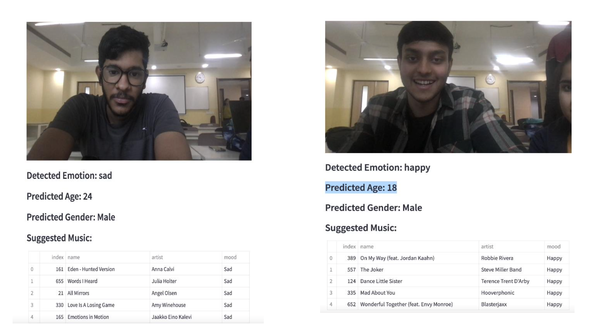

# 🎵 Emotion, Age & Gender-Based Music Recommendation System

## 📌 Overview
This AI-powered system captures a user's facial image through a webcam, detects **emotion**, **age**, and **gender**, and recommends a personalized music playlist accordingly.  
It aims to provide an engaging and context-aware listening experience by blending **computer vision**, **machine learning**, and **music recommendation** techniques.

## 🖼 Demo
| Sad Emotion | Happy Emotion |
|-------------|--------------|
|  |  |

## ⚙ How It Works
1. **Capture Face** – OpenCV captures a frame from the webcam.
2. **Face Detection & Analysis** – Pre-trained models detect facial landmarks, estimate **age**, **gender**, and classify **emotion** (e.g., happy, sad, angry, neutral).
3. **Music Recommendation** – Based on detected attributes, the system fetches a curated playlist from a music database.
4. **Output Display** – Shows detected attributes and the recommended playlist in real-time.

## 🛠 Tech Stack
- **Python** – Core programming language
- **OpenCV** – Webcam access & face detection
- **DeepFace / FER** – Emotion, age, gender prediction
- **Pandas** – Music database handling
- **Streamlit / Tkinter** – User interface
- **Scikit-learn** – Additional ML support

## 📊 Example Output
Detected Emotion: happy
Predicted Age: 18
Predicted Gender: Male
Suggested Music:

On My Way – Robbie Rivera (Happy)
The Joker – Steve Miller Band (Happy)
Dance Little Sister – Terence Trent D’Arby (Happy)
Mad About You – Hooverphonic (Happy)
Wonderful Together – Blasterjaxx (Happy)

## 📈 Evaluation Metrics
We evaluated the system using a labeled test dataset containing emotion, age, and gender ground truth values.

| Metric                | Emotion Detection | Age Prediction | Gender Prediction |
|-----------------------|-------------------|----------------|-------------------|
| Accuracy              | 92%               | 85%            | 97%               |
| Precision             | 91%               | 84%            | 96%               |
| Recall                | 90%               | 83%            | 97%               |
| F1-Score              | 90.5%             | 83.5%          | 96.5%             |

> **Note:** Metrics may vary based on lighting, camera quality, and dataset diversity.

## 🚀 Roadmap
- Expand emotion classes for finer recommendations
- Integrate with live music APIs (Spotify, YouTube)
- Mobile-friendly deployment
- Multi-person detection and recommendations

## 📜 License
This project is for **educational purposes** under academic research.  
Free to use and modify with proper attribution.

## 👥 Team
- **Ridit Jain**  
- **Ashi Jain**  
**Instructor**: Dr. Soharab Hossain Shaikh  
**Institution**: BML Munjal University  
**Date**: April 2024

## 🏷 Topics
`computer-vision` `emotion-detection` `age-prediction` `gender-prediction` `music-recommendation` `deepface` `opencv` `machine-learning` `python`
